# CA1: Version Control with Git

**Student:** Miguel Sousa Antunes

**Course:** DevOps

**Programme:** Switch Dev

**Institution:** Instituto Superior de Engenharia do Porto


# Introduction

This report documents the work related to the first Class Assignment (CA1) of the **DevOps** class. This assignment is primarily focused on implementing best practices in **version control systems**, in this case, regarding **Git**. This Class Assignment was divided into **two parts**. In **Part 1** we learned about basic version control without branches, whilst in **Part 2** the concept of _branches_ was introduced in order to handle new features and bug fixes. The culmination of these two parts is discussed in the final section of this report.


## Workflow

I will be showcasing all the exact steps needed to ensure the project's instructions were followed, both in **Part 1** and in **Part 2**.

# Part 1

## Development in the Main Branch

I started off by cloning the existing repository of the React and Spring Tutorial, through the IDE's command-line, with the following Git command:

`git clone https://github.com/spring-attic/tut-react-and-spring-data-rest.git`

Afterwards, I set up my own private repository in order to manage the class's assignments with version control. I set up my own repository through GitHub's official website and proceeded to get the repository's link in order to clone it through the IDE's command line, just like before with:

`git clone https://github.com/MiguelAntuns7/devops-24-25-1241918.git`

A different way to approach this could have been to:

1. Create a new project in my IDE, and, in the command-line, type `git init`, which would then initialize a local repository.

2. Create a remote repository through GitHub's web interface.

3. Connect the local repository to the remote one with `git remote add origin https://github.com/MiguelAntuns7/devops-24-25-1241918.git`.

Regarding the React and Spring Data REST tutorial's repository, for this Class Assignment, only the Basic folder was necessary. So I then navigated to the repository's directory through Git's bash with:

`cd "C:\Users\Miguel\Desktop\Desenvolvimento de Software\IDE\tut-react-and-spring-data-rest"`

And proceeded to copy the Basic folder to my own repository, with:

`cp -r basic "C:\Users\Miguel\Desktop\Desenvolvimento de Software\IDE\devops-24-25-1241918"`

After ensuring the basic folder was successfully copied to my own repository, I added the ReadMe file and used the gitignore.io website to properly update the _gitignore_ with the necessary entries. This led to the first commit of the repository, which was made with the following commands:

`git add .`

`git commit -m "*commit message*"`

`git push`

After the first commit was done, a good practice adopted was to tag it in a specific way. Following the versioning pattern mentioned in the professor's instructions, major.minor.revision, I tagged it the following way:

`git commit *HashCode of the desired commit* v1.1.0`

Additionally, we were instructed to create issues on GitHub regarding the main tasks we were trying to accomplish. My first issue was directed towards the creation of the attribute jobYears in the Employee class and the validation and testing of all class attributes and methods. I also assigned a relevant label to each issue throughout the assignment, in order to keep my work more organized.

### Implementation

1. I started off by adding the jobYears attribute to the Employee class's attributes:

``` java
	private Integer jobYears; 
```

2. Added the attribute to the constructor along with the creation of a method that valides parameters:

``` java
    public Employee(String firstName, String lastName, String description, String jobTitle, Integer jobYears) {

		validateParameters(firstName, lastName, description, jobTitle, jobYears);

		setFirstName(firstName);
		setLastName(lastName);
		setDescription(description);
		setJobTitle(jobTitle);
		setJobYears(jobYears);
	}

	public void validateParameters (String firstName, String lastName, String description, String jobTitle, Integer jobYears) {

		if (firstName == null || firstName.isEmpty())
			throw new IllegalArgumentException("First Name field must not be empty.");

		if (lastName == null || lastName.isEmpty())
			throw new IllegalArgumentException("Last Name field must not be empty.");

		if (description == null || description.isEmpty())
			throw new IllegalArgumentException("Description field must not be empty.");

		if (jobTitle == null || jobTitle.isEmpty())
			throw new IllegalArgumentException("Job Title field must not be empty.");

		if (jobYears == null || jobYears < 0)
			throw new IllegalArgumentException("Job Years field must be a positive value.");
	}
```
3. Added the new attribute field to the already existing methods: equals, hashCode, toString

``` java
@Override
	public boolean equals(Object o) {
		if (this == o) return true;
		if (o == null || getClass() != o.getClass()) return false;
		Employee employee = (Employee) o;
		return Objects.equals(id, employee.id) &&
				Objects.equals(firstName, employee.firstName) &&
				Objects.equals(lastName, employee.lastName) &&
				Objects.equals(description, employee.description) &&
				Objects.equals(jobTitle, employee.jobTitle) &&
				Objects.equals(jobYears, employee.jobYears);
	}

	@Override
	public int hashCode() {

		return Objects.hash(id, firstName, lastName, description, jobTitle, jobYears);
	}
	
	@Override
	public String toString() {
		return "Employee{" +
				"id=" + id +
				", firstName='" + firstName + '\'' +
				", lastName='" + lastName + '\'' +
				", description='" + description + '\'' +
				", jobTitle='" + jobTitle + '\'' +
				", jobYears='" + jobYears + '\'' +
				'}';
	}
```

4. Created respective getter and setter for the new attribute

``` java
    public Integer getJobYears () {
        return jobYears;
    }
    
    public void setJobYears (Integer jobYears) {
        if (jobYears == null || jobYears < 0)
            throw new IllegalArgumentException("Job Years field must be a positive value.");
    
        this.jobYears = jobYears;
    }
```

5. Added the jobYears field to the render methods in the class app.js:

``` javascript
    class EmployeeList extends React.Component{
        render() {
            const employees = this.props.employees.map(employee =>
                <Employee key={employee._links.self.href} employee={employee}/>
            );
            return (
                <table>
                    <tbody>
                        <tr>
                            <th>First Name</th>
                            <th>Last Name</th>
                            <th>Description</th>
                            <td>Job Title</td>
                            <th>Job Years</th>
                        </tr>
                        {employees}
                    </tbody>
                </table>
            )
        }
    }
    
    class Employee extends React.Component{
        render() {
            return (
                <tr>
                    <td>{this.props.employee.firstName}</td>
                    <td>{this.props.employee.lastName}</td>
                    <td>{this.props.employee.description}</td>
                    <td>{this.props.employee.jobTitle}</td>
                    <td>{this.props.employee.jobYears}</td>
                </tr>
            )
        }
    }
```

6. Added input on the new field in the class DatabaseLoader

``` java
    @Override
	public void run(String... strings) throws Exception { // <4>
		this.repository.save(new Employee("Frodo", "Baggins", "ring bearer", "DevOps Engineer", 5));
	}
```

After adding the jobYears attribute, I added validations for all Employee class's attributes and created tests for method in the class.

7. Created the following tests for the respective methods in the Employee class

- shouldCreateEmployee
- shouldThrowExceptionIfFirstNameIsInvalid
- shouldThrowExceptionIfLastNameIsInvalid
- shouldThrowExceptionIfDescriptionIsInvalid
- shouldThrowExceptionIfJobTitleIsInvalid
- shouldThrowExceptionIfJobYearsIsInvalid
- testEqualsMethod
- testEqualsMethodIsNotEqual
- testHashCode
- testHashCodeFalse
- testGetIdAndSetId
- testGetFirstNameAndSetFirstName
- testInvalidSetFirstName
- testGetLastNameAndSetLastName
- testInvalidSetLastName
- testGetDescriptionAndSetDescription
- testInvalidSetDescription
- testGetJobTitleAndSetJobTitle
- testInvalidSetJobTitle
- testGetJobYearsAndSetJobYears
- testInvalidSetJobYears
- testToString

Afterwards, I **ran the application** by:

1. Changing directory with: ``cd`` until I was inside the basic folder `C:\devops-24-25-1241918\CA1\part1\basic`.
2. Running the command `.\mvnw spring-boot:run`.

This would compile the spring-boot application for a few seconds and then have it running.

3. Meanwhile, I opened my web browser and typed ``localhost:8080`` in order to be redirected to the locally hosted application.

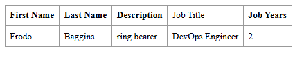

This allowed me to visualize my changes in the application's interface and debug it through the browser's "Inspect" mode with the help of the "React Developer Tools" extension.

4. With the web application working, after right-clicking anywhere on the web page I accessed the 'Inspect' mode of my web browser in order to, with the help of the React Developer Tools extension, access source code of the web application. I accessed the 'Components' tab on top of the 'Inspect' window, and with Ctrl + P searched for the class "app.js".

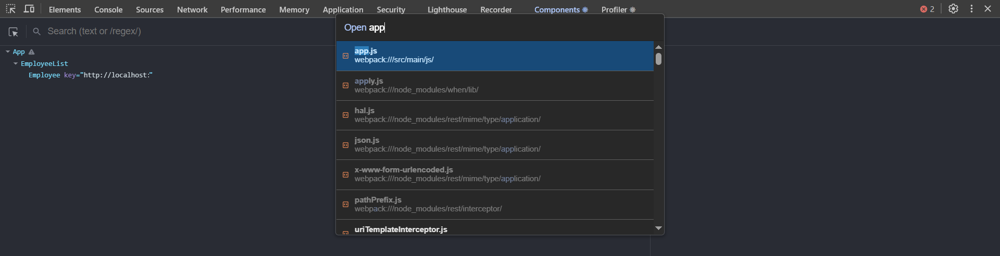

5. Selected 'EmployeeList' component in order to run the debugger.


After that, and once everything was correctly implemented, it was time to commit my changes. This was done with:

1. ``git status`` in order to see the files I had changes in.

2. ``git add [path of the files I wanted to commit]`` in order to add the changed files to the staging area, ready to be commited.

3. ``git commit -m [commit message]`` to build the commit.

4. ``git push`` to send the commit to my private repository.

5. ``git tag [tag] [HashCode of the commit]`` e.g. : ``git tag v1.4.0 2dc313a``

After doing this, I marked the respective issue with "Done", completing part 1.1 of the first Class Assignment.


## Development with Branches

In this segment of the part 1 of the first Class Assignment (CA1), we will develop new features and resolve fixes with the help of using Branches in our VCS (Version Control System), with an emphasis on isolated environments and merging them with the Main environment later on.

In this first part we were instructed to create a new branch called "email-field" where we would be implementing a new field for an email.
We would create this feature and this new branch should then be merged into the main branch.

I started off by typing ``git checkout -b email-field`` in my IDE's terminal, in order to create a new Branch called "email-field". This is where the new feature of the new email field will be implemented.
Afterwards, I typed ``git checkout email-field`` in order to enter the new feature-related branch in order to implement the email field.

### Implementation of the new Email field

The new email field was added to the respective classes in order to ensure the web application reflected this new feature.

1. First, the **Employee** class.

Addition to the Class's attributes:

```private String email;```

Constructor of the Employee class:

```
public Employee(String firstName, String lastName, String description, String jobTitle, Integer jobYears, String email) {

		validateParameters(firstName, lastName, description, jobTitle, jobYears, email);

		setFirstName(firstName);
		setLastName(lastName);
		setDescription(description);
		setJobTitle(jobTitle);
		setJobYears(jobYears);
		setEmail(email);
	}
```

Validation in the validation method:

```if (email == null || email.isEmpty)
			throw new IllegalArgumentException("Email field must be a valid email.");
```

Addition of the field in the "equals" method, in the "hashcode" method and the "toString" method.

Creation of the get and set methods for the email attribute:

```
public String getEmail () {
    return this.email;
}
```

```
public void setEmail (String email) {
    if (email == null || email.isEmpty)
        throw new IllegalArgumentException("Email field must be a valid email.");

    this.email = email;
}
```

Addition of the field in the previously created tests.

Creation of the test for the get and set email methods:

```
@Test
void testGetEmailAndSetEmail() {
    // Arrange
    Employee employee = new Employee("Miguel", "Antunes", "Employee", "DevOps Engineer", 5, "miguel@gmail.com");

    // Act
    employee.setEmail("joao@gmail.com");

    // Assert
    assertEquals("joao@gmail.com", employee.getEmail());
}
```

2. Addition of this field to the frontend layer

Addition in the render methods in app.js:

```
render() {
    const employees = this.props.employees.map(employee =>
        <Employee key={employee._links.self.href} employee={employee}/>
    );
    return (
        <table>
            <tbody>
                <tr>
                    <th>First Name</th>
                    <th>Last Name</th>
                    <th>Description</th>
                    <td>Job Title</td>
                    <th>Job Years</th>
                    <th>Email</th>
                </tr>
                {employees}
            </tbody>
        </table>
    )
}
```

```
render() {
    return (
        <tr>
            <td>{this.props.employee.firstName}</td>
            <td>{this.props.employee.lastName}</td>
            <td>{this.props.employee.description}</td>
            <td>{this.props.employee.jobTitle}</td>
            <td>{this.props.employee.jobYears}</td>
            <td>{this.props.employee.email}</td>
        </tr>
    )
}
```

3. Database Loader

```
public void run(String... strings) throws Exception { // <4>
		this.repository.save(new Employee("Frodo", "Baggins", "ring bearer", "DevOps Engineer", 2, "miguel@gmail.com"));
}
```

After the addition of this field, I merged the two branches together by:

- Checking out into the 'main' branch:

``git checkout main``

- And then merging the two branches together:

``git merge --no-ff email-field``

After the implementation of this new field, the development of this new feature was done and ready to commited to my remote repository.
However, in my workflow, I made the mistake of making changes in my branch right after creating it, then commiting my changes inside the branch, and only then pushing the creation of this new branch.
This led to issues because the branch didn't exist remotely when I pushed my commit, which led to the main branch taking these changes right when I pushed the creation of the branch.

The **correct approach** would have been to:

- Push the creation of new branch as soon as I created it
- Work on the new branch
- Commit those changes
- Checkout into the 'main' branch
- Merge the email-field branch into the 'main' branch with ``git merge --no-ff email-field``
- Push the merge into my remote repository with ``git push origin main``

Mistakenly handling the creation and merge of the branch led to me missing a commit regarding the merge, which, consecutively, led to me missing what should have been the tag v1.6.0

### New feature for the Email field

After handling the addition of the email field, the need to validate this field came up.
This meant that a new branch called "fix-invalid-email" had to be created where the workflow should be similar to the previous email field implementation. The labels that marked this issue were "feature" and "bug fix". 

1. First of all, the new branch was created with:

``git checkout -b fix-invalid-email``

2. Afterwards, I checked into that branch and pushed its creation.

3. Changed the following validation inside the validation of the email attribute:

```
if (email == null || !email.contains("@"))
    throw new IllegalArgumentException("Email field must be a valid email.");
```

The validation now checks if the email contains the '@' character which helps the system recognize if the user inserted a valid email.

4. Following this, I created a test that validates if the text of the email not containing an '@' sends a message to the user saying it is not a valid email.

```

public static Stream<Arguments> provideInvalidEmail() {
    return Stream.of(
            Arguments.of("Miguel", "Antunes", "Employee", "DevOps Engineer", 5, null, "Email field must be a valid email."),
            Arguments.of("Miguel", "Antunes", "Employee", "DevOps Engineer", 5, "", "Email field must be a valid email."),
            Arguments.of("Miguel", "Antunes", "Employee", "DevOps Engineer", 5, "miguel.isep.ipp.pt", "Email field must be a valid email.")
    );
}

@ParameterizedTest
@MethodSource ("provideInvalidEmail")
void testInvalidSetEmail(String firstName, String lastName, String description, String jobTitle, Integer jobYears, String email, String expectedMessage) {
    // Arrange
    Employee employee = new Employee(firstName, lastName, description, jobTitle, 5, "miguel@gmail.com");

    // Act + Assert
    Exception exception = assertThrows(IllegalArgumentException.class, () -> {
        employee.setEmail(email);
    });
    assertEquals(expectedMessage, exception.getMessage());
}
```

5. Then I commited my changes inside the "fix-invalid-email" branch:

6. After that, I checked into the 'main' branch and merged both branches with:

`` git merge --no-ff fix-invalid-email ``

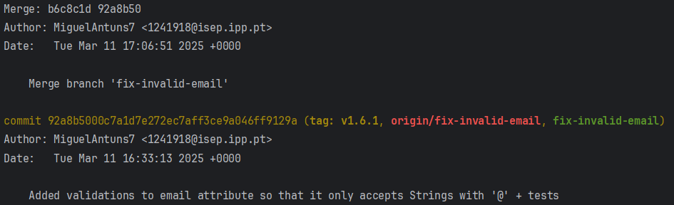

This commit was marked with the tag v1.6.1, considering that the previous email implementation was supposed to have been v1.6.0

### Conclusion

Both instances where the need for branch creation was necessary were extremely helpful in getting to know Git's workflow a lot better. Specially considering the previously mentioned mistake I made.
While my mistake was avoidable, it helped me grasp Git's branching and merging process more deeply.


## Analyzing an alternative to Git: Subversion

In this part of the Class Assignment nº1, we were instructed to analyze an alternative solution to the current VCS (Version Control System) we are using, Git.
I decided to go with Subversion (SVN) considering that, although Git is the main Version Control System in the market, Subversion is also considerably well known.

Comparison between Git and Subversion:

1. **Repository Structure**

Although Git is a distributed Version Control System where each developer has a complete local repository with full history, SVN (Subversion) is a centralized version control with a single server-side repository that clients check out from.

2. **Branching and Merging, respectively**

Opposite to Git, SVN is a little bit more heavyweight, considering that branches are directories in the repository's structure. Git, on the other hand has branches that are local references that can exist independently, making the branching more lightweight and also designed for frequent use.

3. **Workflow Differences**

Git has a very non-linear development workflow, encouraging, has previously mentioned, frequent branching and respective merging.
SVN, on the other hand, has a much more linear development model with occasional branches for major features.

4. **History and Commits**

Git stores snapshots of the full project in each commited version, in content-addressable storage. While SVN handles it via file-based delta storage. It tracks changes to individual files over time.

5. **Network Dependency**

Git does **not** require network access as most operations are local. While in SVN most operations require server connection, except, of course, basic file editing.

6. **Tagging**

In Git, tags are references to specific commits (through the commits hashcode), while SVN's tags are directory copies in the structure of the respective repository.

### Considering the Class Assignments requirements/goals, how could have Subversion been be used?

In this short segment, I will showcase how the Version Control System's operations would have worked if Subversion was being used instead of Git.

1. Repository Setup:

- Creating a new SVN repository with ``svnadmin create C:/devops-24-25-1241918``
- Alternatively from cloning, and because GitHub repositories aren't directly accessible via SVN protocol, I could download the repository as a ZIP file from GitHub
- Create the standard SVN directory structure in my new repository:
```
svn mkdir file:///C:/devops-24-25-1241918/trunk -m "Creating trunk directory"
svn mkdir file:///C:/devops-24-25-1241918/branches -m "Creating branches directory"
svn mkdir file:///C:/devops-24-25-1241918/tags -m "Creating tags directory"
```

- Import the basic project with: ``svn import basic file:///C:/devops-24-25-1241918/trunk -m "Initial import"``
- Checkout a working copy: ``svn checkout file:///C:/devops-24-25-1241918/trunk C:/workspace/trunk-working``


2. Commiting changes

- Instead of ``git add .`` and ``git commit``, I would use ``svn add`` for new files and ``svn commit -m "commit message"`` to send changes to the repository

3. Versioning and Tagging

- Instead of ``git tag v1.1.0 [commit hashcode]``, I would have to create a tag with ``svn copy file:///C:/devops-24-25-1241918/trunk file:///C:/devops-24-25-1241918/tags/v1.1.0 -m "Tagging version 1.1.0"``

4. Feature Implementation (jobYears e.g.)

- After making changes to add the jobYears attribute, I would do: ``svn commit -m "Added jobYears field with validation and tests"``

5. Branch creation for Email Field

- Instead of ``git checkout -b email-field`` to create a branch, I would have to use:

```
svn copy svn copy file:///C:/devops-24-25-1241918/trunk  \
         file:///C:/devops-24-25-1241918/branches/email-field  \
         -m "Creating branch for email field feature"

svn checkout file:///C:/devops-24-25-1241918/branches/email-field \
         C:\workspace\email-field-working
```

Then I should work in the 'email-field' branch, commit the changes to the branch, then merge with:

```
cd trunk-working-dir
svn merge file:///C:/devops-24-25-1241918/branches/email-field
svn commit -m "Merged email field feature from branch"
```

## Conclusion of the First Part of the Class Assignment

Throughout Part 1 of this Class Assignment, I had the opportunity to dive deeper into Version Control operations using Git. By implementing different features through commiting, branching and merging I was able to improve my Git skills in ways I would not have been able to in other courses.
I also valued the structured, responsible and linear workflow we were instructed to follow in order to learn the best practices regarding Git.
The analysis of a different Version Control System was very interesting in the sense that, even though Git and Subversion are different VCS's they have quite a few similar commands, which cements how relevant Git has become in today's market.


# Part 2

This is a demo application that implements a basic multithreaded chat room server.
The server supports several simultaneous clients through multithreading.
When a client connects the server requests a screen name, and keeps requesting a name until a unique one is received.
After a client submits a unique name, the server acknowledges it. Then all messages from that client will be broadcast to all other clients that have submitted a unique screen name.
A simple "chat protocol" is used for managing a user's registration/leaving and message broadcast.

### Prerequisites

* Java JDK 8 (or newer)
* Apache Log4J 2
* Gradle 7.4.1 (if you do not use the gradle wrapper in the project)

## Workflow

In the beggining of this part 2 of the first Class Assignment, the first step was to download the Gradle Basic Demo repository from BitBucket.
After having downloaded this repository, the next step was to copy its contents into my own repository.
I did this through Git's bash with the commands seen in the following print screen: 

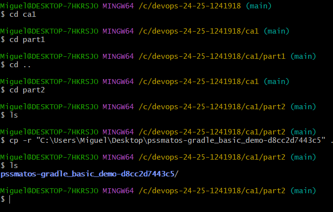

After doing this, I changed directories until I was inside the folder with all of the application's main folders.
Then, I compiled the source code and packaged it into an executable .jar file with the following command: ``./gradlew build``.

**Visual representation:**

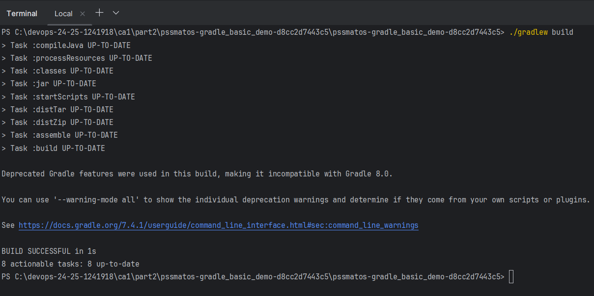


### **Server setup:**

**Change** into the root **directory**:

    cd ca1
    cd part2
    cd .\pssmatos-gradle_basic_demo-d8cc2d7443c5\
    cd .\pssmatos-gradle_basic_demo-d8cc2d7443c5\

Open the terminal and execute the following command from inside the project's root directory:

    java -cp build/libs/basic_demo-0.1.0.jar basic_demo.ChatServerApp <server port>

Substitute "<server port>" by a valid por number, e.g. 59001

The terminal will then indicate that the server is actively running:

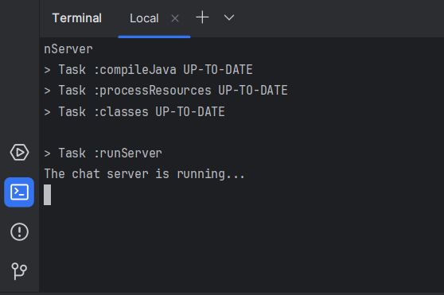

### **Client setup:**

Open another terminal and execute the following gradle task from the project's root directory:

    % ./gradlew runClient

The above task assumes the chat server's IP is "localhost" and its port is "59001". If you whish to use other parameters please edit the runClient task in the "build.gradle" file in the project's root directory.

After running the Client side, the application will ask for a name, which must be unique in the chat room you're entering.

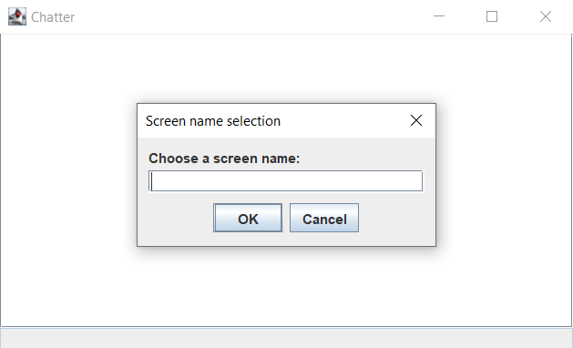

To **run multiple clients**, you just need to open more terminals and repeat the invocation of the "runClient" gradle task. You are now ready to message the person in the same chat room as yourself.

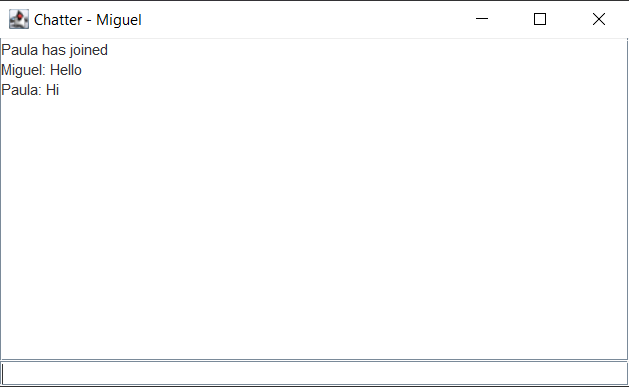


If you wish to leave the chat room simply click on the "X" button in the top right corner and the chat room will indicate that "[user] has left".
The terminal running the server will indicate which users have left along with the status of the running server:

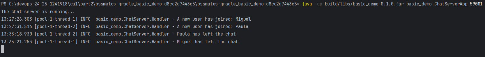


To close the server, simply press Ctrl + C (SIGINT) to interrupt the server's running process and press "Y" (Yes) to confirm.


## Implementation of new tasks

### Implementation of "runServer" task

In order to improve this project and the initialization of the server, I added a runServer task to the "build.gradle" file. The addition of this task allowed to simply type the gradle command: ``./gradlew runServer`` in the terminal instead of the whole ``java -cp build/libs/basic_demo-0.1.0.jar basic_demo.ChatServerApp <server port>`` command.
This task was set as type JavaExec in order to execute Java applications. I also specified the task's dependencies as being the classes in order to make sure all the necessary classes for this task will be compiled before the server launches on the specified port '59001'.

```
task runServer(type: JavaExec, dependsOn: classes) {
    group = "DevOps"
    description = "Launches the chat server listening on port 59001."

    classpath = sourceSets.main.runtimeClasspath

    mainClass = 'basic_demo.ChatServerApp'

    args '59001'
}
```

In order to test the addition of the functionality, the task was executed with the previously mentioned command: ``./gradlew runServer`` in the terminal.
I could see the task was running successfully with the terminal's feedback displaying the message that tells me the chat server is running:

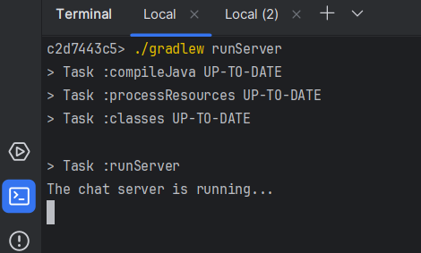


#### Add a unit test

In this segment we will be adding a unit test to cement the App's functions are correctly operating. I created a new directory inside the ``src`` folder: ``test/java/basic_demo/AppTest.java``.
To ensure the test environment was correctly identifying JUnit tests, I added the following dependency to the dependencies method call inside the "build.grade" file:

`` testImplementation 'junit:junit:4.12' ``


I then added the test that verifies if the class "App" returns a greeting that is **not** *null*.

To execute this test and verify that it is running successfully, I ran the gradle command ``./gradlew test``.
Below we can see the terminal's output when running the previous command:


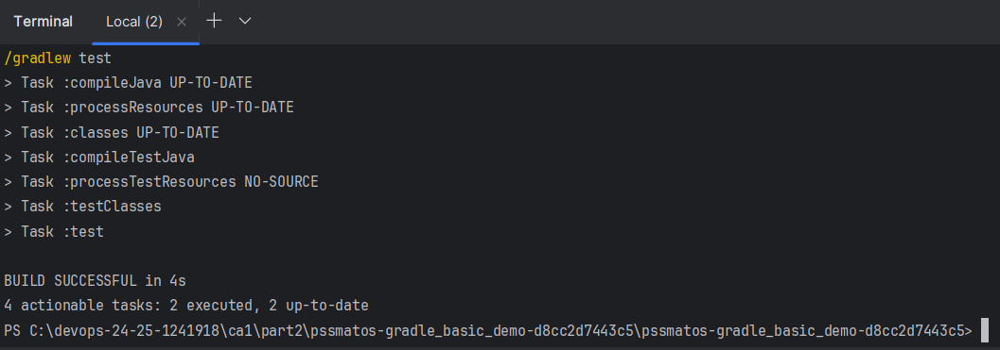


### Implementation of "backup" task

This new task was supposed to make a backup of the source code, ensuring that there is an available way of recovering any lost files in case that any issues occur during development.
The "backup" task is declared with Gradle's "Copy" type, in order to replicate the contents inside the "src" folder.

```
task backup(type: Copy) {
    group = "DevOps"
    description = "Copies the sources of the application to a backup folder."

    from 'src'
    into 'backup'
}
```

I ran this task with ``./gradlew backup`` and the following output was returned by the server:

    > Task :backup UP-TO-DATE

    BUILD SUCCESSFUL in 823ms
    1 actionable task: 1 up-to-date

As it is possible to observe with the following screenshot, a "backup" folder was then created:

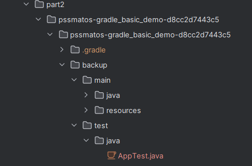


### Implementation of "Zip" task

This new task was intended to make an archive (zip file) where all the contents inside the "src" folder would be inside, compressed.
This last task involved creating a task of type Zip that would package the project's source code into a compressed .zip file, making it useful for backups and to distribute the project.

``
task archive(type: Zip) {
group = "DevOps"
description = "Creates a zip archive of the source code"

    from 'src'
    archiveFileName = 'src_backup.zip'
    destinationDir(file('build'))
}
``

I ran this task with ``./gradlew archive`` and the following output was returned by the server:

    > Task :archive
    BUILD SUCCESSFUL in 1s
    1 actionable task: 1 executed

The .zip file with the contents of the "src" folder was then created:

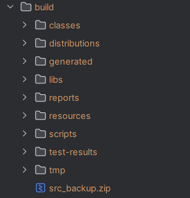

## Conclusion of the Second Part of the Class Assignment

This second part of the first Class Assignment provided hands-on experience with Gradle, revealing its usefulness as a flexible build automation tool. Working with Gradle's tasks regarding the chat room application was a solid demonstration of its capabilities beyond just compiling code.
The implementation of custom tasks like the "runServer" significantly streamlined the development workflow. Instead of typing lengthy commands to launch the server, I could simply call the "runServer" task using the previously mentioned command.
This task automation is one of Gradle's key strengths in the context of DevOps. Creating other tasks like the "backup" and "archive" tasks also highlighted Gradle's utility beyond compilation and testing.
The nature of Gradle scripts, combined with its task-based architecture, makes it a powerful tool for streamlining development workflows.
Overall, this part of the Class Assignment helped me broaden my understanding of build tools in the software development world.