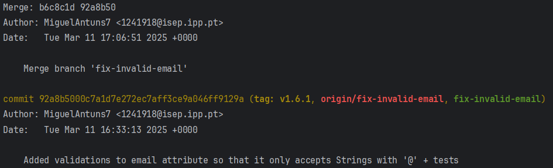
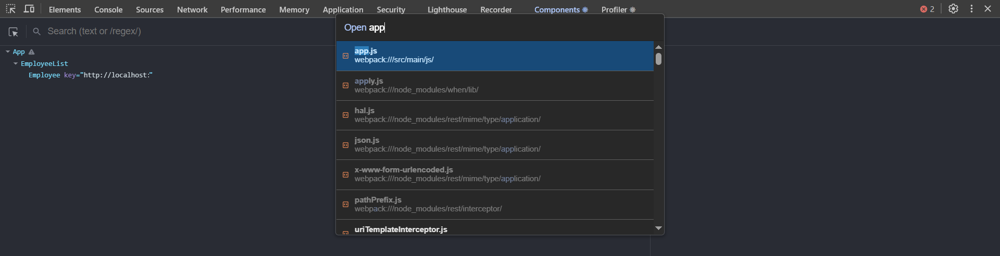
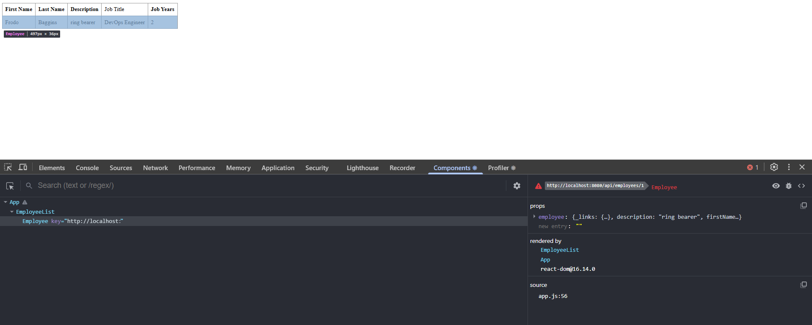

# CA1: Version Control with Git

**Student:** Miguel Sousa Antunes

**Course:** DevOps

**Programme:** Switch Dev

**Institution:** Instituto Superior de Engenharia do Porto


# Introduction

This report documents the work related to the first Class Assignment (CA1) of the **DevOps** class. This assignment is primarily focused on implementing best practices in **version control systems**, in this case, regarding **Git**. This Class Assignment was divided into **two parts**. In **Part 1** we learned about basic version control without branches, whilst in **Part 2** the concept of _branches_ was introduced in order to handle new features and bug fixes. The culmination of these two parts is discussed in the final section of this report.


# Workflow

I will be showcasing all the exact steps needed to ensure the project's instructions were followed, both in **Part 1** and in **Part 2**.

## Part 1: Development in the Main Branch

I started off by cloning the existing repository of the React and Spring Tutorial, through the IDE's command-line, with the following Git command:

`git clone https://github.com/spring-attic/tut-react-and-spring-data-rest.git`

Afterwards, I set up my own private repository in order to manage the class's assignments with version control. I set up my own repository through GitHub's official website and proceeded to get the repository's link in order to clone it through the IDE's command line, just like before with:

`git clone https://github.com/MiguelAntuns7/devops-24-25-1241918.git`

A different way to approach this could have been to:

1. Create a new project in my IDE, and, in the command-line, type `git init`, which would then initialize a local repository.

2. Create a remote repository through GitHub's web interface.

3. Connect the local repository to the remote one with `git remote add origin https://github.com/MiguelAntuns7/devops-24-25-1241918.git`.

Regarding the React and Spring Data REST tutorial's repository, for this Class Assignment, only the Basic folder was necessary. So I then navigated to the repository's directory through Git's bash with:

`cd "C:\Users\Miguel\Desktop\Desenvolvimento de Software\IDE\tut-react-and-spring-data-rest"`

And proceeded to copy the Basic folder to my own repository, with:

`cp -r basic "C:\Users\Miguel\Desktop\Desenvolvimento de Software\IDE\devops-24-25-1241918"`

After ensuring the basic folder was successfully copied to my own repository, I added the ReadMe file and used the gitignore.io website to properly update the _gitignore_ with the necessary entries. This led to the first commit of the repository, which was made with the following commands:

`git add .`

`git commit -m "*commit message*"`

`git push`

After the first commit was done, a good practice adopted was to tag it in a specific way. Following the versioning pattern mentioned in the professor's instructions, major.minor.revision, I tagged it the following way:

`git commit *HashCode of the desired commit* v1.1.0`

Additionally, we were instructed to create issues on GitHub regarding the main tasks we were trying to accomplish. My first issue was directed towards the creation of the attribute jobYears in the Employee class and the validation and testing of all class attributes and methods. I also assigned a relevant label to each issue throughout the assignment, in order to keep my work more organized.

## Implementation

1. I started off by adding the jobYears attribute to the Employee class's attributes:

``` java
	private Integer jobYears; 
```

2. Added the attribute to the constructor along with the creation of a method that valides parameters:

``` java
    public Employee(String firstName, String lastName, String description, String jobTitle, Integer jobYears) {

		validateParameters(firstName, lastName, description, jobTitle, jobYears);

		setFirstName(firstName);
		setLastName(lastName);
		setDescription(description);
		setJobTitle(jobTitle);
		setJobYears(jobYears);
	}

	public void validateParameters (String firstName, String lastName, String description, String jobTitle, Integer jobYears) {

		if (firstName == null || firstName.isEmpty())
			throw new IllegalArgumentException("First Name field must not be empty.");

		if (lastName == null || lastName.isEmpty())
			throw new IllegalArgumentException("Last Name field must not be empty.");

		if (description == null || description.isEmpty())
			throw new IllegalArgumentException("Description field must not be empty.");

		if (jobTitle == null || jobTitle.isEmpty())
			throw new IllegalArgumentException("Job Title field must not be empty.");

		if (jobYears == null || jobYears < 0)
			throw new IllegalArgumentException("Job Years field must be a positive value.");
	}
```
3. Added the new attribute field to the already existing methods: equals, hashCode, toString

``` java
@Override
	public boolean equals(Object o) {
		if (this == o) return true;
		if (o == null || getClass() != o.getClass()) return false;
		Employee employee = (Employee) o;
		return Objects.equals(id, employee.id) &&
				Objects.equals(firstName, employee.firstName) &&
				Objects.equals(lastName, employee.lastName) &&
				Objects.equals(description, employee.description) &&
				Objects.equals(jobTitle, employee.jobTitle) &&
				Objects.equals(jobYears, employee.jobYears);
	}

	@Override
	public int hashCode() {

		return Objects.hash(id, firstName, lastName, description, jobTitle, jobYears);
	}
	
	@Override
	public String toString() {
		return "Employee{" +
				"id=" + id +
				", firstName='" + firstName + '\'' +
				", lastName='" + lastName + '\'' +
				", description='" + description + '\'' +
				", jobTitle='" + jobTitle + '\'' +
				", jobYears='" + jobYears + '\'' +
				'}';
	}
```

4. Created respective getter and setter for the new attribute

``` java
    public Integer getJobYears () {
        return jobYears;
    }
    
    public void setJobYears (Integer jobYears) {
        if (jobYears == null || jobYears < 0)
            throw new IllegalArgumentException("Job Years field must be a positive value.");
    
        this.jobYears = jobYears;
    }
```

5. Added the jobYears field to the render methods in the class app.js: 

``` javascript
    class EmployeeList extends React.Component{
        render() {
            const employees = this.props.employees.map(employee =>
                <Employee key={employee._links.self.href} employee={employee}/>
            );
            return (
                <table>
                    <tbody>
                        <tr>
                            <th>First Name</th>
                            <th>Last Name</th>
                            <th>Description</th>
                            <td>Job Title</td>
                            <th>Job Years</th>
                        </tr>
                        {employees}
                    </tbody>
                </table>
            )
        }
    }
    
    class Employee extends React.Component{
        render() {
            return (
                <tr>
                    <td>{this.props.employee.firstName}</td>
                    <td>{this.props.employee.lastName}</td>
                    <td>{this.props.employee.description}</td>
                    <td>{this.props.employee.jobTitle}</td>
                    <td>{this.props.employee.jobYears}</td>
                </tr>
            )
        }
    }
```

6. Added input on the new field in the class DatabaseLoader

``` java
    @Override
	public void run(String... strings) throws Exception { // <4>
		this.repository.save(new Employee("Frodo", "Baggins", "ring bearer", "DevOps Engineer", 5));
	}
```

After adding the jobYears attribute, I added validations for all Employee class's attributes and created tests for method in the class.

7. Created the following tests for the respective methods in the Employee class

- shouldCreateEmployee
- shouldThrowExceptionIfFirstNameIsInvalid
- shouldThrowExceptionIfLastNameIsInvalid
- shouldThrowExceptionIfDescriptionIsInvalid
- shouldThrowExceptionIfJobTitleIsInvalid
- shouldThrowExceptionIfJobYearsIsInvalid
- testEqualsMethod
- testEqualsMethodIsNotEqual
- testHashCode
- testHashCodeFalse
- testGetIdAndSetId
- testGetFirstNameAndSetFirstName
- testInvalidSetFirstName
- testGetLastNameAndSetLastName
- testInvalidSetLastName
- testGetDescriptionAndSetDescription
- testInvalidSetDescription
- testGetJobTitleAndSetJobTitle
- testInvalidSetJobTitle
- testGetJobYearsAndSetJobYears
- testInvalidSetJobYears
- testToString

Afterwards, I **ran the application** by:

1. Changing directory with: ``cd`` until I was inside the basic folder `C:\devops-24-25-1241918\CA1\part1\basic`.
2. Running the command `.\mvnw spring-boot:run`.

This would compile the spring-boot application for a few seconds and then have it running.

3. Meanwhile, I opened my web browser and typed ``localhost:8080`` in order to be redirected to the locally hosted application.



This allowed me to visualize my changes in the application's interface and debug it through the browser's "Inspect" mode with the help of the "React Developer Tools" extension.

4. With the web application working, after right-clicking anywhere on the web page I accessed the 'Inspect' mode of my web browser in order to, with the help of the React Developer Tools extension, access source code of the web application. I accessed the 'Components' tab on top of the 'Inspect' window, and with Ctrl + P searched for the class "app.js".



5. Selected 'EmployeeList' component in order to run the debugger.



After that, and once everything was correctly implemented, it was time to commit my changes. This was done with:

1. ``git status`` in order to see the files I had changes in.

2. ``git add [path of the files I wanted to commit]`` in order to add the changed files to the staging area, ready to be commited.

3. ``git commit -m [commit message]`` to build the commit.

4. ``git push`` to send the commit to my private repository.

5. ``git tag [tag] [HashCode of the commit]`` e.g. : ``git tag v1.4.0 2dc313a``

After doing this, I marked the respective issue with "Done".