# Class Assignment 2

## Part 1

### Introduction

This technical report outlines the procedures and results of Class Assignment 2 – Part 1, which focused on virtualization. The main goal was to gain practical experience in setting up and managing virtual environments, which is a fundamental skill for modern development and operations workflows.

The report details the creation and configuration of a virtual machine running Ubuntu, the setup of a Java-based development environment, and the execution of the projects previously developed in the last assignment. Emphasis is placed on the challenges faced during environment setup and how those were overcome inside the VM.

In addition to completing the required setup steps, particular attention was given to diagnosing and resolving environment-specific issues, which is an inevitable part of real-world DevOps workflows. This included dealing with version mismatches, build configuration errors, and Operative System differences between host and guest environments. By overcoming these obstacles, I gained valuable insight into the practical challenges of environment replication and consistency, which are essential for achieving reliability across development, testing, and deployment pipelines.


## Creating a VM

The first step was to configure a Virtual Machine (VM). I already had a Linux VM set-up from my previous Computation Systems and Networks class, which meant that this issue was already tackled for me.
Although my virtual environment was set up with VMware, if you wish to use a different hypervisor, or if you do not have any, you can use the free versions of either one of these hypervisors: VMware, VirtualBox, Hyper-V.
The Linux Distribution (Distro) system that we were supposed to use for this assignment was Ubuntu.

After setting up a hypervisor of your choice, you should inject an image (ISO) with the minimal installation media (https://help.ubuntu.com/community/Installation/MinimalCD).
You should also attribute your Virtual Machine 2048 MB of RAM.


## Network Settings and Configurations

After having that all of that set up, you should create a Host-Only Network Adapter.

In __VMware__, you should go into the top right corner and click "Edit", and then "Virtual Network Editor". You should then click on "Add Network" and make it Host-Only, so that our Virtual Machine (guest) can communicate with our physical machine (host).

In __VirtualBox__, you should go to the Main Menu, select File -> Host Network Manager (Ctrl + W). When you see an empty white box saying "Host-Only Networks", you should click the "Create" button (Ctrl + A), creating a new Host-Only Network.

After having the Network Adapter set up, you should check the IP address range, which was ``192.168.56.1/24``. I chose ``192.168.56.5``, as it falls within the designated subnet.

After setting up the VM, we should update the package repositories with ``sudo apt update``.
Afterward, you should install the network tools (net-tools) package with ``sudo apt install net-tools`` to facilitate network configuration. This was already installed on my guest machine.

You should then assign the chosen IP address by editing the network configuration file. You can do this by executing ``sudo nano /etc/netplan/01-netcfg.yaml``.
After that, you should apply those changes with ``sudo netplan apply``.

To enable remote access of the Virtual Machine, you should install and configure the OpenSSH server. This should be done using the following command: ``sudo apt install openssh-server``.
After installation, you should modify the SSH configuration to allow password-based authentication. This involved editing the SSH daemon config file: ``sudo nano /etc/ssh/sshd_config``.
Inside the file, locate and uncomment the following line: ``PasswordAuthentication yes``.
After saving the changes, restart the SSH service to apply the newly introduced changes with ``sudo service ssh restart``.

This setup allows you to securely access the VM from your host machine or other devices within the same network, using an SSH client and the IP address previously configured on the Host-Only network adapter.

To facilitate file transfers between host and guest, I installed and configured an FTP server using vsftpd (Very Secure FTP Daemon). You can use the following command: ``sudo apt install vsftpd``.

Once installed, you should modify the configuration to allow write access enabling the ability to upload files to the VM.
This was done by editing the FTP file: ``sudo nano /etc/vsftpd.conf``.
Inside the file, locate and uncomment the following line: ``write_enable=YES``.

Now you are able to use an FTP client (like FileZilla, for example) from your physical machine to your virtual machine using its static IP address and transfer files in both directions.


## Cloning my private repository

To clone my own CA1 repository to inside my virtual machine, I configured SSH-based authentication. This allowed the VM to communicate with GitHub without requiring username and/or password.

1. Generate an SSH key

First of all, generate an SSH key by typing: ``ssh-keygen -t ed25519 -C "insert your email"``.
You can accept the default file location (``~/.ssh/id_ed25519``) and decide whether to add a password to access it or not. I did not.

You can verify if the key was correctly saved with: ``ls ~/.ssh/``.

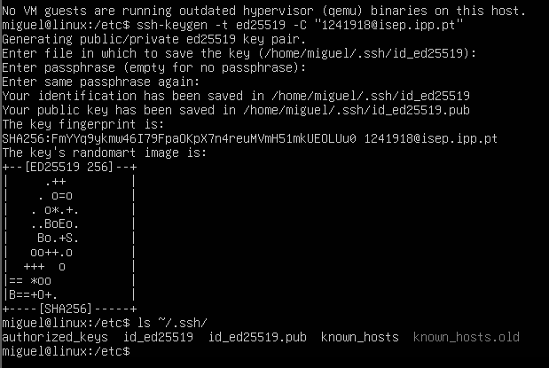

2. Add the SSH key to GitHub

To authorize the VM, I accessed the public key with: ``cat ~/.ssh/id_ed25519.pub``.
I copied the output and added it to my GitHub account by navigating into:

```
GitHub → Settings → SSH and GPG keys → New SSH key
```

I named it ``VM SSH key`` and proceeded to paste my SSH key.

3. Clone the repository

Once the SSH key was added to GitHub, I cloned the repository into the VM with: ``git clone git@github.com:miguelantuns7/devops-24-25-1241918.git``.


## Set Up Development Environment

With the VM fully configured, I proceeded to install the essential dependencies/tools required to work with my java projects.
I started by updating the package list and upgrading existing software with:

```
sudo apt update
sudo apt upgrade
```

Then, I installed Git to enable source code management with: ``sudo apt install git``.

Since the projects target Java 17, I installed the appropriate java version with:
``sudo apt install openjdk-17-jdk openjdk-17-jre``.

Although some projects are configured to use Maven or Gradle, these are managed via their respective build tool wrappers (``mvnw`` and ``gradlew``).
Therefore, installing Maven or Gradle globally was not strictly necessary.

**Note: If you want to use Gradle outside of a wrapper, you can manually installed version 8.6 with ``sdk install gradle 8.13``, extracting it to /opt/gradle, and updating the PATH. This step is totally optional.**

To verify that everything was properly installed and accessible, I checked the versions of the key tools:

```
git --version
java --version
```

## Executing the repository's projects

In this section I will be showcasing the Class Assignment 1's projects running in the guest machine (the Linux VM).

### Executing the Spring-Boot and React Web App

One of the first tasks inside the VM was to run the Sprint Boot tutorial project developed in the previous assignment. The aim was to verify that the VM's Java environment could properly support a Maven-based Sprint Boot web application.

I started by _cd'ing_ into the project's ``basic`` folder inside CA1 - part1, which contains the Spring Boot source code along with the Maven wrapper script.

To run the application, I used the provided Maven wrapper. When already inside the basic folder, run ``./mvnw spring-boot:run`` to have the web application running locally.

Once the server started, access the running web app from your browser. Since the VM was configured with a static IP address on a Host-Only network (192.168.56.5), I simply visited http://192.168.56.5:8080/.

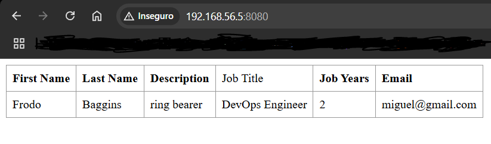


### Executing the Gradle Chat App

Now I will be attempting to run the ``gradle_basic_demo`` from the CA1's part 2.
It consists of a client-server chat application built with Gradle.

Inside the VM, I navigated into the gradle_basic_demo's root project directory and built the project with ``./gradlew build``.

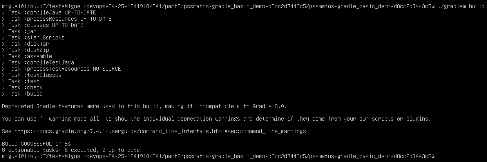

After that, I intended to run the server with ``./gradlew runServer``, but ran into a problem with the java version. This chat app project is using java 17, which I, as you could see before in this ReadMe, made sure to have installed. But turns out that, when I ran ``java --version``, the system was recognizing java 23.
When trying to do ``./gradlew runServer``, the system threw the following error:

```
Value C:/Users/Miguel/.jdks/corretto-17.0.14 given for org.gradle.java.home
Gradle property is invalid.
```

This was confusing at first, because I ran into no issues when running the project through IntelliJ in my physical machine.

First, I did ``readlink -f $(which java)`` in order to see the real path of the current Java version being used under the hood. It confirmed to me that the system was using Java 23.

After inspecting the project setup, I discovered that the file ``gradle.properties`` was explicitly setting the Java home path to a Windows location, which in Linux obviously isn't possible. To ensure the Virtual Machine was pointing to the correct Java version, I:

- Did ``sudo update-alternatives --config java`` to list all the available Java versions the system had. I switched from Java 23 to 17.

- With ``nano`` as the text editor, I edited the ``gradle.properties`` file to comment out the invalid Windows path:

```
# org.gradle.java.home=C:/Users/Miguel/.jdks/corretto-17.0.14
```

This removed the hardcoded Java path in the project's configuration.

After these adjustments, I ran ``./gradlew runServer`` and the server launched successfully, confirming that the VM was now using Java 17 and that Gradle was no longer pointing to the wrong version.

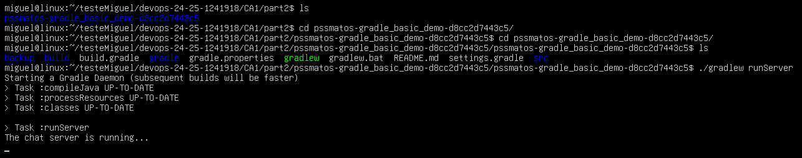

This was useful in understanding how configuration files influence build tools like Gradle with the previously handled ``gradle.properties`` file.

Considering the project is now ready to be executed, and the server is already running in my guest machine, I opened Windows Powershell, navigated into CA1/part2's root directory and ran the client-side on my Host machine with ``./gradlew runClient --args="192.168.56.5 59001"``.
This allowed the client on my physical machine to communicate with the server running in the VM by specifying the VM's IP address and respective port number.

The chat app was then working as expected:

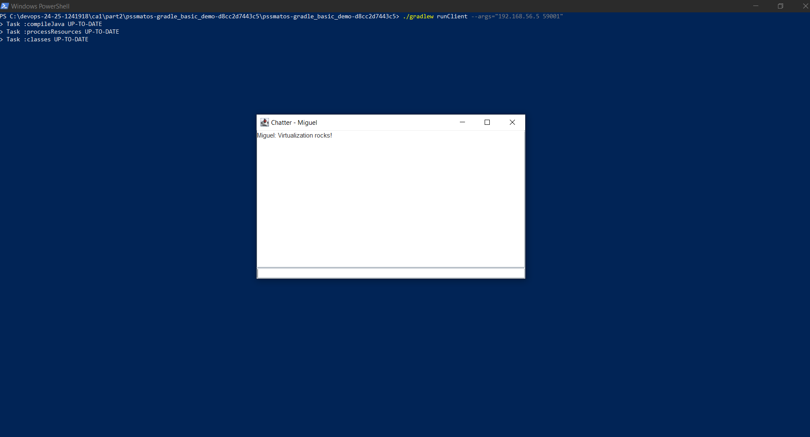


### Executing the Gradle-versioned Spring-Boot and React Web App

In this part, I showcase how it was possible to run the Gradle version of the Spring Boot application.

1. I navigated into ``devops-24-25-1241918/CA1/part3/react-and-spring-data-rest-basic``.

2. Did ``./gradlew build`` to build the Part 3 project, and ran the web app with ``./gradlew bootRun``.

Once the server was running in the VM, and just like the Maven version of the web app, I simply accessed it locally in http://192.168.56.5:8080/.


## Conclusion of Part 1

This report covered the setup and use of a virtual machine to execute the previously developed Java-based projects in a controlled environment. The process included configuring network access, secure file transfer, and installing development tools required for building and running Spring Boot and Gradle applications.

While running the Gradle chat app, I ran into an issue with Java versions. Even though I had Java 17 installed, the VM was still defaulting to Java 23, and Gradle was picking up the wrong path. Fixing this taught me how Gradle pulls configuration from both the system and the project's configuration files.

Overall, this assignment gave me practical experience with virtualization and environment management, both of which are extremely important DevOps skills in today's world.


## Part 2

### Introduction

This section of the technical documentation covers the implementation and configuration of a virtualized environment using Vagrant. The primary objective was to establish a development environment that closely mimics production settings by creating a multi-machine setup with Spring Boot and H2 database components.

The assignment required configuring virtual machines to host a Spring Boot application connected to an H2 database, ensuring proper network configuration for seamless communication between components. This approach demonstrates practical application of DevOps principles by enabling consistent, reproducible development environments.


### Setup

First of all, I had to install Vagrant. I accessed [Vagrant's official website](https://www.vagrantup.com/downloads) and downloaded the Windows AMD64 version.

After that, I opened my Windows Powershell terminal and typed ``vagrant --version`` to verify if Vagrant was properly installed on my machine.

### Trying out Vagrant

In order to wet my feet with Vagrant, I downloaded [my professor's repository](https://bitbucket.org/pssmatos/vagrant-multi-spring-tut-demo/src/master/) on BitBucket.

I had always been using VMware as my Hypervisor, and that was the provider Vagrant was recognizing.
But, for some reason, Vagrant was not letting me work with VMware properly, demanding some sort of license key. So I was forced to install VirtualBox. I accessed [VirtualBox's official website](https://www.virtualbox.org/wiki/Downloads) and downloaded the most recent version to my Windows machine.

Now, with the help of the Windows Powershell, and after downloading, I _cd'd_ into the root directory containing the VagrantFile, written in Ruby, opened my terminal and typed ``vagrant up``.
This command, following the instructions written inside the VagrantFile, orders Vagrant to initialize two Virtual Machines. One for the ``web`` application and another for the ``database``.

Once both VMs were up, you could access them through the following URLs:
http://localhost:8080/basic-0.0.1-SNAPSHOT/
http://localhost:8080/basic-0.0.1-SNAPSHOT/h2-console


### Setup CA1 Project

In this part, I will elaborate on how I adapted Vagrant to my own ``CA1/part3`` project.

The first step was to copy my professor's ``vagrant file`` to my own ``CA2/part2`` directory.
After having done that, the vagrant file was customized in order to function with my **CA1** project.

#### First Steps:

1. I changed the GitHub URL to clone my own private remote repository
2. With the ``cd`` (change directory) command, I added the instruction for the script to, after cloning, go into the root directory of my ``CA1/part3`` project.
3. Afterward, I added the ``./gradlew bootRun`` task, in order to run the SpringBoot application.

```
# Change the following command to clone your own repository!
git clone git@github.com:MiguelAntuns7/devops-24-25-1241918.git
cd devops-24-25-1241918/CA1/part3/react-and-spring-data-rest-basic
chmod u+x gradlew
./gradlew clean build
./gradlew bootRun
# To deploy the war file to tomcat9 do the following command:
sudo cp ./build/libs/basic-0.0.1-SNAPSHOT.jar /var/lib/tomcat9/webapps
```

4. Enabled SSH Agent Forwarding in order to allow to Virtual Machine to use the SSH credentials (that were created later on) from the host machine.

``config.ssh.forward_agent= true``

5. I also added a command to the script that automatically makes the VM add GitHub.com to the list of known SSH Hosts.

```
if [ -e ~/.ssh/known_hosts ]; then
        echo "### Known Hosts exist"
          if [ ! -n "$(grep "^github.com " ~/.ssh/known_hosts)" ]; then
                echo "### Adding Key"
                ssh-keyscan github.com >> ~/.ssh/known_hosts 2>/dev/null
          fi
      else
            echo "### Known Hosts missing!!!"
            ssh-keyscan github.com >> ~/.ssh/known_hosts 2>/dev/null
      fi
      echo "### sleeping 2 seconds"
      sleep 2
      echo "### done"
      ssh -T git@github.com
```


#### SSH Authentication Setup

Because this DevOps project's instructions were for our remote repository to be private from the start, scripting vagrant file so that the VM clones it requires authentication.
But, obviously, the whole idea of this Vagrant process is to automate things. So there was the need to resolve this authentication "issue" without manual user intervention.

This was done using ``SSH agent forwarding``, which lets the Virtual Machine access the SSH key directly from the Host Machine.

1. Created an SSH key on my Host machine.

2. Added the key to my GitHub account's SSH credentials.

3. Started the SSH agent:

``eval "$(ssh-agent -s)"``

4. Added my SSH key to the agent:

``ssh-add ~/.ssh/id_ed25519``


#### My full Vagrant File

```
# See: https://manski.net/2016/09/vagrant-multi-machine-tutorial/
# for information about machine names on private network
  Vagrant.configure("2") do |config|
   config.ssh.forward_agent= true

  # This provision is common for both VMs
  config.vm.provision "shell", inline: <<-SHELL
    sudo apt-get update -y
    sudo apt-get install -y iputils-ping avahi-daemon libnss-mdns unzip \
        openjdk-17-jdk-headless
    # ifconfig
  SHELL

  #============
  # Configurations specific to the database VM
  config.vm.define "db" do |db|
    db.vm.box = "ubuntu/bionic64"
    db.vm.hostname = "db"
    db.vm.network "private_network", ip: "192.168.56.11"

    # We want to access H2 console from the host using port 8082
    # We want to connet to the H2 server using port 9092
    db.vm.network "forwarded_port", guest: 8082, host: 8082
    db.vm.network "forwarded_port", guest: 9092, host: 9092

    db.vm.provider "virtualbox"

    # We need to download H2
    db.vm.provision "shell", inline: <<-SHELL
      wget https://repo1.maven.org/maven2/com/h2database/h2/1.4.200/h2-1.4.200.jar
    SHELL

    # The following provision shell will run ALWAYS so that we can execute the H2 server process
    # This could be done in a different way, for instance, setiing H2 as as service, like in the following link:
    # How to setup java as a service in ubuntu: http://www.jcgonzalez.com/ubuntu-16-java-service-wrapper-example
    #
    # To connect to H2 use: jdbc:h2:tcp://192.168.33.11:9092/./jpadb
    db.vm.provision "shell", :run => 'always', inline: <<-SHELL
      java -cp ./h2*.jar org.h2.tools.Server -web -webAllowOthers -tcp -tcpAllowOthers -ifNotExists > ~/out.txt &
    SHELL
  end

  #============
  # Configurations specific to the webserver VM
  config.vm.define "web" do |web|
    web.vm.box = "ubuntu/bionic64"
    web.vm.hostname = "web"
    web.vm.network "private_network", ip: "192.168.56.10"

    # Copy SSH keys to the VM
    web.vm.provision "file", source: "~/.ssh/id_ed25519", destination: "~/.ssh/id_ed25519"
    web.vm.provision "file", source: "~/.ssh/id_ed25519.pub", destination: "~/.ssh/id_ed25519.pub"

    # We set more ram memory for this VM
    web.vm.provider "virtualbox" do |v|
      v.memory = 1024
    end

    # We want to access tomcat from the host using port 8080
    web.vm.network "forwarded_port", guest: 8080, host: 8080

    web.vm.provision "shell", inline: <<-SHELL, privileged: false
      # Set proper permissions on the SSH key
      chmod 600 ~/.ssh/id_ed25519

      # Rest of your provisioning script...
      sudo apt install -y tomcat9 tomcat9-admin

      if [ -e ~/.ssh/known_hosts ]; then
        echo "### Known Hosts exist"
          if [ ! -n "$(grep "^github.com " ~/.ssh/known_hosts)" ]; then
                echo "### Adding Key"
                ssh-keyscan github.com >> ~/.ssh/known_hosts 2>/dev/null
          fi
      else
            echo "### Known Hosts missing!!!"
            ssh-keyscan github.com >> ~/.ssh/known_hosts 2>/dev/null
      fi
      echo "### sleeping 2 seconds"
      sleep 2
      echo "### done"
      ssh -T git@github.com

      # Change the following command to clone your own repository!
      git clone git@github.com:MiguelAntuns7/devops-24-25-1241918.git
      cd devops-24-25-1241918/CA1/part3/react-and-spring-data-rest-basic
      chmod u+x gradlew
      ./gradlew clean build
      ./gradlew bootRun
      # To deploy the war file to tomcat9 do the following command:
      sudo cp ./build/libs/basic-0.0.1-SNAPSHOT.war /var/lib/tomcat9/webapps
    SHELL
  end
end
```

#### My full Spring Boot configuration

1. Application Properties file

```
server.servlet.context-path=/basic-0.0.1-SNAPSHOT
spring.data.rest.base-path=/api
spring.datasource.url=jdbc:h2:tcp://192.168.56.11:9092/./jpadb;DB_CLOSE_DELAY=-1;DB_CLOSE_ON_EXIT=FALSE
spring.datasource.driverClassName=org.h2.Driver
spring.datasource.username=sa
spring.datasource.password=
spring.jpa.database-platform=org.hibernate.dialect.H2Dialect
spring.h2.console.enabled=true
spring.h2.console.path=/h2-console
spring.h2.console.settings.web-allow-others=true
```

2. App.js file

```
componentDidMount() { // <2>
    client({method: 'GET', path: '/basic-0.0.1-SNAPSHOT/api/employees'}).done(response => {
        this.setState({employees: response.entity._embedded.employees});
    });
}
```


#### Executing the Application

To start everything up, I did a ``vagrant status`` to verify if everything was fine and ready to be executed.
After that, I simply opened my Git Bash through IntelliJ, and did ``vagrant up``.

Once everything is running, you can access:

- The Spring Boot application at http://localhost:8080/basic-0.0.1-SNAPSHOT/
- The H2 database console at http://localhost:8082/
  
For the **H2 console**, you should insert this URL in the connection details:

**JDBC URL:** jdbc:h2:tcp://192.168.56.11:9092/./jpadb

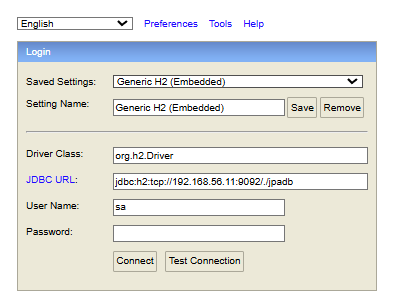

After accessing the H2 DataBase console, it was possible to then write in the text box any query that we wanted regarding the Spring Boot project, such as ``SELECT * FROM Employee``

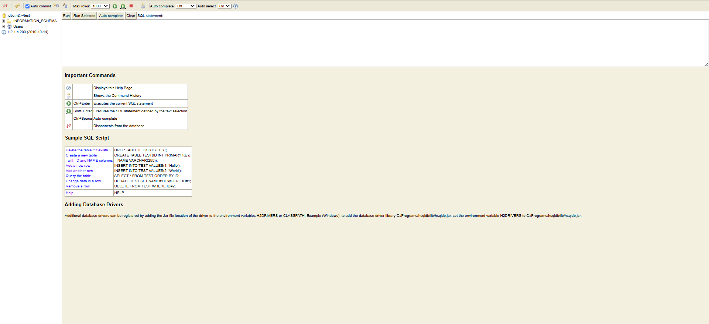


#### Analysing an Alternative - VMware

Since VMware (both Workstation and Fusion) is now free, you could access [VMware's official website](https://www.vmware.com/products/desktop-hypervisor/workstation-and-fusion) in order to download either of these versions.

After that, install the Vagrant VMware Utility (a bridge between Vagrant and VMware) through [HashiCorp's official website](https://developer.hashicorp.com/vagrant/docs/providers/vmware/vagrant-vmware-utility).

Then, you would have to purchase and install the Vagrant VMware plugin with ``vagrant plugin install vagrant-vmware-desktop``.

Now, regarding the VagrantFile script:

I have set up my VagrantFile to specifically use VirtualBox as the provider because it was recognizing VMware, for some reason.
But, actually, Vagrant works with VirtualBox by default, which would make it mandatory for you to tell Vagrant to use VMware as the provided Hypervisor.

Instead of having ``[NameOfTheVM].vm.provider "virtualbox"`` in the script, it should be ``[NameOfTheVM].vm.provider "vmware_desktop"`` 

Either that, or you can simply run ``vagrant up`` with the ``--provider`` flag and the ``=vmware_desktop`` specification right after.

``vagrant up --provider=vmware_desktop``


### Conclusion of Part 2

This project successfully implemented a virtualized development environment using Vagrant, with a Spring Boot application connected to an H2 database.
The automation provided by Vagrant ensures a consistent and reproducible setup, which is essential for DevOps practices.

The key challenges of this part of the second Class Assignment were mostly directed towards having the configuration files (VagrantFile, application properties, etc) correctly set-up so that the script would work correctly.

I appreciated the way it was possible to simply, in a matter of seconds, create and/or destroy Virtual Machine/s.
It also touches a little bit on the "it works on my machine" problem. Although that sentence is more related to Docker, which we will be touching on later in this Class Assignment, there is some emphasys to be made on the fact that **anyone** with this Vagrant File can run the exact same setup I'm using.


## Part 3

The goal of this part3 of the Class Assignment 2 was to containerize the chat server application using Docker, exploring two approaches to building and deploying that same application.

This report documents the implementation of the two versions of the Docker solution:

- Version 1: The chat server is built entirely inside the Dockerfile using a multi-stage process.
- Version 2: The chat server is built on the host machine, and the resulting JAR file is copied into the Docker image.

Both versions were tested by running the chat application in a container and connecting to it using multiple Clients. The images were then pushed to the Docker Hub.
The following sections provide a step-by-step guide to reproducing the assignment including the setup, Dockerfile configurations, build and run commands, etc.

### Setup

Before doing anything, we'll need to install Docker on our machine. 
Because Docker (Linux) containers need a Linux kernel in order to virtualize on the OS layer, we'll need either ``WSL-2`` or ``Hyper-V``.

``WSL-2`` is usually the best option considering it is a fast and lightweight solution compared to a fully fledged Hypervisor like Hyper-V.
It also uses Hyper-V under the hood without having to actually install it.

After having the WSL (Windows Subsystem for Linux) installed, you can install Docker through [Docker's official website](https://www.docker.com/products/docker-desktop/).
After having Docker Desktop installed, you should create an account.

When the setup of Docker is done. You should open your terminal and do a ``docker login``. If you are logged-in on Docker Desktop, the terminal should return the following message:

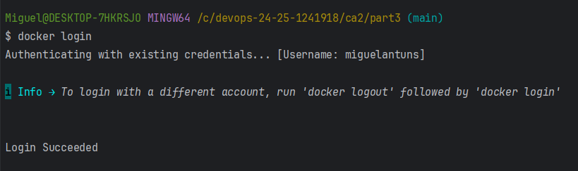

### Version 1 : Cloning through the DockerFile

After having done the setup properly, you should create a folder for the Version 1. You can create it with the ``mkdir`` command.

Subsequently, you should create a Dockerfile that will build a Docker Image, which consecutively generates a Container.
A container is essentially an isolated environment with everything you need to run an application.


``My Dockerfile:``

```
FROM gradle:jdk17 AS builder

WORKDIR /CA2/part3/version1

# Clone the gradle basic demo BitBucket repository
RUN git clone https://bitbucket.org/pssmatos/gradle_basic_demo.git

WORKDIR /CA2/part3/version1/gradle_basic_demo

RUN chmod +x gradlew && ./gradlew build --no-daemon

FROM eclipse-temurin:17-jre

WORKDIR /app

COPY --from=builder /CA2/part3/version1/gradle_basic_demo/build/libs/basic_demo-0.1.0.jar /app/basic_demo-0.1.0.jar

EXPOSE 59001

ENTRYPOINT ["java", "-cp", "/app/basic_demo-0.1.0.jar", "basic_demo.ChatServerApp", "59001"]
```

This Dockerfile dictates the Container's behaviour by using a multi-stage build to keep the final image lightweight. At a first instance, it clones the chat app repository and runs the server-side.

Having the Dockerfile set-up, we can build the Docker Image with: ``docker build -t <Your_Docker_Username>/chat-server:[Tag_For_This_Image] .`` .
The ``-t`` tag is used to tag the image with a name and a version. In my case it was marked as ``docker build -t MiguelAntuns/chat-server:version1 .``

Afterwards, you can check if the image was properly created with ``docker images``. This command will show you all the images associated to your Docker account, as shown below:

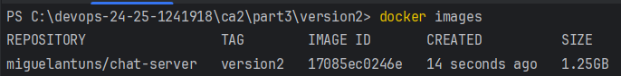


Considering the Docker Image was already created, I ran the Container with ``docker run -p 59001:59001 MiguelAntuns/chat-server:version1``.
Then, I got the message that the server was running and I opened up two more tabs on the terminal and changed directory into my CA1/part2 in order to run the ``runClient`` task, that boots up the client-side.

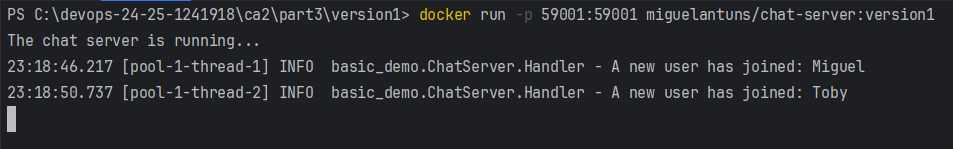

I was then free to chat between users.

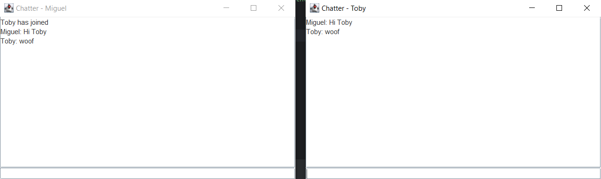

After ensuring the Container hosted the server-side of the chat app and connecting to it through my host machine, it was time to push this Docker Image to DockerHub, the remote Docker Images repository.

This could be accomplished through running the command ``docker push MiguelAntuns/chat-server:version1``.
But I ran into an issue. Docker doesn't allow Docker Images to have capital letters, which my Docker Image did.

To fix this, I had to rename it to only have lowercase letters by doing: ``docker tag MiguelAntuns/chat-server:version1 miguelantuns/chat-server:version1``.

This might seem like it created another Image, but truthfully it just creates another reference to that same image, as it is observable through the ``Image ID`` tab when running ``Docker Images``.

Once re-tagged, I was able to successfully push the Image to Docker Hub with ``docker push MiguelAntuns/chat-server:version1``.

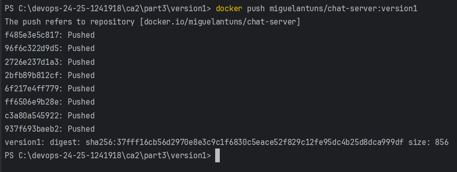